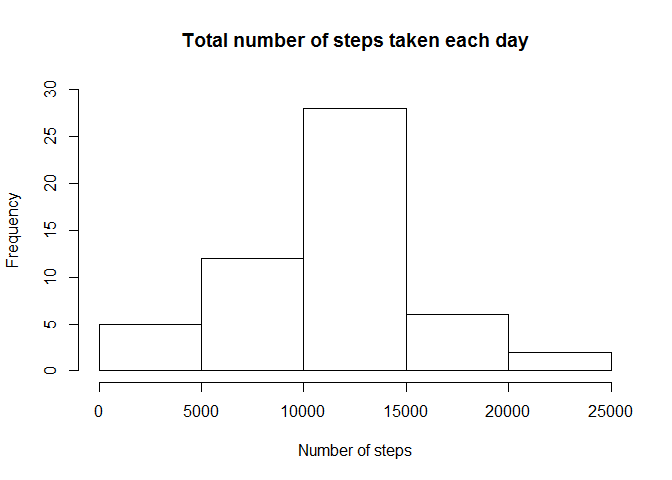
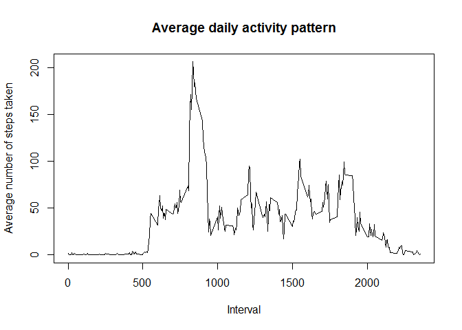
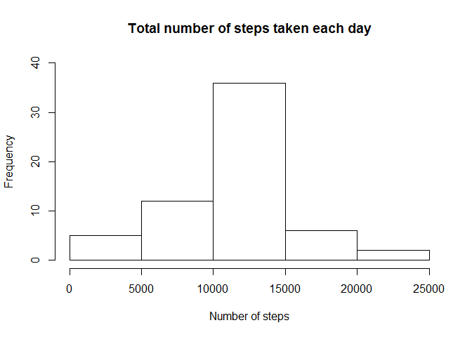

# Reproducible Research: Peer Assessment 1

## Introduction
- always use echo = TRUE so that someone else will be able to read the code

```r
library(knitr)
library(lattice)
opts_chunk$set(echo = TRUE)
```

## Loading and preprocessing the data

**(1) Load the data (i.e. read.csv())**

```r
wd <- getwd()
fileUrl <- "http://d396qusza40orc.cloudfront.net/repdata%2Fdata%2Factivity.zip"
file <- "repdata-data-activity.zip"

# NOTE: The following line helped to let download.file() work fine in 
# Windows 7 environment if the url is not http but https.
#
# setInternet2(use = TRUE)

# NOTE: If on Mac, you may need to set method="curl" for download.file
download.file(fileUrl, file)
unzip(file, exdir = wd)
# Load the data into the current working directory (i.e. read.csv())
data <- read.csv(paste(wd, "/activity.csv", sep =""))
```

**(2) Process/transform the data (if necessary) into a format suitable for your analysis**

```r
# Merge date and interval columns into one POSIXct class column called datetime
data$datetime <- strptime(paste(data$date, sprintf("%04d", data$interval)),
                          format = "%Y-%m-%d %H%M")
# Convert the data type of "interval" from Integer to Factor
data$interval <- as.factor(data$interval)
```

## What is mean total number of steps taken per day?

**(1) Make a histogram of the total number of steps taken each day**

```r
meantotal <- tapply(data$steps, data$date, sum)
hist(meantotal, xlim=c(0, 25000), ylim=c(0, 30),
     main = "Total number of steps taken each day", xlab = "Number of steps")
```

 

**(2) Calculate and report the mean and median total number of steps taken per day**

- mean

```r
mean(meantotal, na.rm = TRUE)
```

```
## [1] 10766.19
```

- median

```r
median(meantotal, na.rm = TRUE)
```

```
## [1] 10765
```

## What is the average daily activity pattern?

**(1) time series plot of the 5-minute interval (x-axis) and the average number of steps taken,
averaged across all days (y-axis)**

```r
d_pattern <- data.frame(interval = sprintf("%04d", as.numeric(levels(data$interval))),
                            d_mean = tapply(data$steps, data$interval, mean, na.rm = TRUE))
plot(as.numeric(as.character(d_pattern$interval)), d_pattern$d_mean, type = "l",
     main = "Average daily activity pattern",
     xlab = "Interval", ylab = "Average number of steps taken")
```

 

**(2) Which 5-minute interval, on average across all the days in the dataset, contains the maximum number of steps?**

```r
d_pattern[(d_pattern$d_mean == max(d_pattern$d_mean)),]
```

```
##     interval   d_mean
## 835     0835 206.1698
```
As indicated above, the 5-minute interval at **8:35am** contains the maximum number of steps, which is approximately **206** steps.

## Imputing missing values

**(1) Calculate and report the total number of missing values in the dataset**

```r
nrow(data[(data$steps == "NA"),])
```

```
## [1] 2304
```

**(2) Devise a strategy for filling in all of the missing values in the dataset**

The strategy for imputing missing data is to **fill in all of the missing values in the original dataset with the mean for that 5-minutes interval**.

**(3) Create a new dataset (impu_data) that is equal to the original dataset but with the missing data filled in**

```r
impu_data <- data
impu_data$interval <- as.factor(sprintf("%04d", as.numeric(levels(data$interval))))
impu_data <- merge(impu_data, d_pattern, by = "interval", all=T)
impu_data$steps <- ifelse(is.na(impu_data$steps), impu_data$d_mean, impu_data$steps)
impu_data <- impu_data[order(impu_data$datetime),]
```

**(4-A) Make a histogram of the total number of steps taken each day**

```r
impu_meantotal <- tapply(impu_data$steps, impu_data$date, sum)
hist(impu_meantotal, xlim=c(0, 25000), ylim=c(0, 40),
     main = "Total number of steps taken each day", xlab = "Number of steps")
```

 

**(4-B) Calculate and report the mean and median total number of steps taken per day**

- mean

```r
mean(impu_meantotal, na.rm = TRUE)
```

```
## [1] 10766.19
```
- median

```r
median(impu_meantotal, na.rm = TRUE)
```

```
## [1] 10766.19
```

- The mean is not different from the estimates from the fist part of the assignment. However, median is different and the new median value is the same as mean value now.
- According to the histogram, the frequency near mean/median got higher from about 27 to 35.

## Are there differences in activity patterns between weekdays and weekends?

**(1) Create a new factor variable in the dataset with two levels - "weekday" and "weekend" indicating whether a given date is a weekday or weekend day**

```r
impu_data$weekdays <- as.factor(ifelse(weekdays(impu_data$datetime)
                                       %in% c("Saturday","Sunday"), "weekend", "weekday"))
```

**(2) Make a panel plot containing a time series plot (i.e. type = "l") of the 5-minute interval (x-axis) and the average number of steps taken, averaged across all weekday days or weekend days (y-axis)**

```r
impu_d_mean = tapply(impu_data$steps, list(impu_data$interval, impu_data$weekdays), mean)
impu_d_pattern <- as.data.frame.table(impu_d_mean)
names(impu_d_pattern) <- c("interval", "weekdays", "impu_d_mean")
impu_d_pattern$interval <- as.numeric(as.character((impu_d_pattern$interval)))
xyplot(impu_d_mean ~ interval | weekdays, data = impu_d_pattern, type = "l",
       xlab = "Interval", ylab = "Number of steps", layout = c(1, 2))
```

 

### Conclusion

There are a few differences in activity patterns between weekdays and weekends.

- The weekdays peak number of steps is higher than that of weekend (However, the 5-minutes intervals that show the peak are almost the same time).
- The subject seems to start getting active later in the morning on weekends than weekdays.
- Similarly, the subject to strget getting inactive later in the evening on weekends than weekdays.
- On weekdays, the subject seems to be more active in the moring between 6:00am and 9:00am than the rest of the day, while his/her activity pattern is overall flat during the day on weekend.

Give the analysis, presumably the subject is busy in the morning to go to the office during weekday but mainly stay at his/her desk between 9:00am and 5:00pm. He/She would not have work on weekends, therefore gets up a little bit late in the morning and also to to bed later at night than weekdays.
